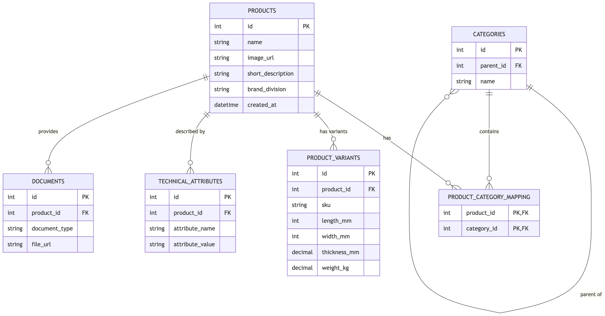

# Building Materials Digital Experience

### Database Architecture & Schema Design
To ensure this application accurately reflects the real-world complexities of the building materials industry, I began the project with a domain research phase, analyzing how products are structured on Knauf's official website.

I quickly realized that a simple, flat products table would not be sufficient or scalable. Building materials are highly variable: insulation rolls are measured by thermal conductivity (WLS) and thickness, drywall boards by fire ratings and dimensions, and plaster by bucket weight and grain size.

To solve this, I designed a normalized, relational database schema inspired by enterprise Product Information Management (PIM) systems, balancing scalability with the scope of an MVP.

##### Key Architectural Decisions:
##### Base Products vs. Variants (SKUs):
Contractors do not buy a generic "Diamant Board"—they buy a specific dimension of it. Therefore, I split the core product data (products table) from the physical items you can actually purchase (product_variants table). This allows a single product overview page to display multiple purchasable SKUs (different lengths, widths, etc.) without duplicating marketing text.

##### Entity-Attribute-Value (EAV) for Technical Specs:
Instead of creating a wide products table with dozens of empty, nullable columns (e.g., leaving a fire_rating column empty for a bucket of plaster), I implemented an EAV model via the technical_attributes table. This allows the application to dynamically attach any number of distinct, searchable properties to a product based on its type.

##### Hierarchical & Many-to-Many Categorization:
Products in this industry often belong to multiple categories (e.g., a product might be both "Plaster" and "Acoustic System"). I implemented a categories table that supports parent-child hierarchies, connected to products via a product_category_mapping bridge table.

##### Dedicated Document Handling:
Technical buyers (architects, planners) rely heavily on compliance and safety sheets. I decoupled documents into their own table to easily support multiple PDFs (Technical Data Sheets, Safety Data Sheets, etc.) per product.

By structuring the database this way, the backend API can efficiently serve complex, filtered queries (e.g., "Show me all non-combustible products for interior walls") while maintaining a clean and scalable data model.

### Database Schema Breakdown

This table explains the purpose of each table in the database and how they work together using a real-world building material example.

| Table Name | Purpose | Easy Example |
| :--- | :--- | :--- |
| **`products`** | Stores the overarching "marketing" concept of the product. | **Name:** "Diamant GKFI" **Description:** "Premium robust drywall board." |
| **`product_variants`** | Stores the actual, physical items (SKUs) that a contractor adds to their cart. | **Variant 1:** 2000mm x 1250mm, 32kg **Variant 2:** 2500mm x 1250mm, 40kg |
| **`categories`** | Organizes the catalog into groups and sub-groups (hierarchical). | "Platten" (Parent Category) -> "Gipsplatten" (Sub-category) |
| **`product_category_mapping`** | A bridge table that allows one product to belong to multiple categories. | "Diamant GKFI" belongs to both the "Gipsplatten" category AND the "Brandschutz" (Fire Protection) category. |
| **`technical_attributes`** | A flexible key-value store for technical properties. Prevents creating hundreds of empty database columns. | **Attribute:** "Brandschutzklasse" (Fire Rating) **Value:** "A2-s1, d0" |
| **`documents`** | Stores links to the mandatory safety and compliance PDFs required by architects. | **Type:** "Technisches Datenblatt" **URL:** `/downloads/diamant_datenblatt.pdf` |

### Sources, References & AI Usage
##### 1. External Sources
To ensure the database schema, filters, and mock data accurately reflected real-world industry standards, the following official source was used during the investigation and data modeling phase:
* **Knauf Germany Official Product Catalog**
  *   **Accessed on:** August 19, 2026
  * **URL:** [https://knauf.com/de-DE/p/produkte](https://knauf.com/de-DE/p/produkte)
  * **Purpose:** Analyzed product categorization, technical specifications, and real-world data structures to design a normalized relational database schema.

##### 2. Use of AI Tools
In accordance with the assignment guidelines, **Google Gemini** was utilized as an assistive tool during the development of this project for:
* **Domain Investigation & Brainstorming:** Exploring building materials domain concepts, EAV database design patterns, and filtering criteria.
* **Documentation & Language Polishing:** Drafting and refining the schema explanations, data dictionary tables, and README documentation for clarity and readability.
* **Code & Schema Review:** Assisting in validating SQL relational structures and naming conventions.

*Note: All architectural decisions, database schemas, API logic, and code implementations were reviewed, understood, and tested by the candidate.*